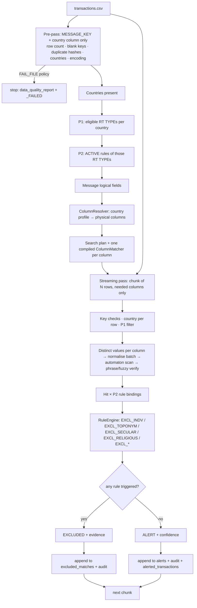

# Transaction Monitoring Framework — Design

This document answers the "before writing code" items of the specification: requirements analysis,
assumptions, architecture, dynamic country schemas, how P1/P2/Intelligence_Lists interact, MESSAGE_KEY handling,
the 5-million-row strategy, memory management, candidate generation, matching, exclusion logic, auditability
and the remaining limitations.

Contents
1. Requirements analysis and traceability
2. Assumptions
3. Architecture
4. Data flow
5. Configuration design — P1, P2, Intelligence_Lists
6. Dynamic schema architecture (with country examples)
7. How P1, P2 and Intelligence_Lists interact
8. MESSAGE_KEY handling
9. The 5-million-row processing strategy
10. Memory management
11. Candidate generation
12. Matching
13. Context classification and exclusion logic
14. Scoring
15. Auditability and reproducibility
16. Errors, policies and exit codes
17. Technology choices
18. Validating accuracy on real data
19. Remaining limitations

---

## 1. Requirements analysis and traceability

The specification asks for a screening *framework*: the business logic (which keywords, which fields, which
countries, which benign explanations) must live in configuration owned by compliance, while the engine must
scale to 5M+ rows, never assume column names, and explain and audit every decision.

| # | Requirement | Implementation | Verified by |
|---|---|---|---|
| 1, 7, 24, 25 | No hard-coded columns; logical → physical mapping | `schema/schema_registry.py`, `schema/column_resolver.py` | `test_schema.py`, `test_end_to_end.py::test_same_rules_screen_us_gb_ae_schemas` |
| 2, 34 | MESSAGE_KEY on every record; duplicates reported; 3 policies | `validation/data_quality.py`, `pipeline/chunk_processor.py` | `test_data_quality.py` |
| 3, 21–23 | Chunked reading, incremental output, bounded memory | `ingestion/transaction_reader.py`, `output/csv_writer.py` | `test_large.py`, `test_end_to_end.py::test_results_do_not_depend_on_chunk_size`, benchmarks |
| 4–6, 17, 18 | P1 / P2 / Intelligence_Lists, ACTIVE only, rule indexes | `ingestion/mapping_reader.py`, `validation/mapping_validator.py`, `scenarios/scenario_engine.py` | `test_mapping.py` |
| 8–12 | Schema profiles in Excel/YAML/JSON/DB, discovery, no silent guessing, multi-column fields | `schema/` | `test_schema.py` |
| 14, 15 | Country by column / CLI / file pattern, configurable order | `schema/country_resolver.py`, `main.py` | `test_country_resolution.py` |
| 16 | P1 filter before matching | search plan contains only eligible rules; ineligible rows never reach a matcher | `test_country_resolution.py::test_p1_filtering_end_to_end` |
| 19, 20 | EXACT/TOKEN/PHRASE/FUZZY, staged, automaton-based | `matching/` | `test_matching.py` (incl. 10,000-keyword parity vs regex reference) |
| 26, 38 | Search plan once per file; one-time vs per-chunk split | `pipeline/search_plan.py`, `monitoring_engine.py` | `search_plan.txt` in every run |
| 27–29 | Independent classifiers on resolved columns | `context/` | `test_context.py`, `test_rules.py` |
| 30–32 | Explanation and audit fields | `pipeline/decision_maker.py`, `output/columns.py` | `test_end_to_end.py::test_audit_record_contract` |
| 33 | DQ + schema validation reports | `validation/` | `test_data_quality.py`, `test_schema.py` |
| 35, 36 | Benchmarks; technology choice by measurement | `benchmarks/` | `docs/BENCHMARK.md` |
| 39 | Deterministic first, confidence/reason/source everywhere | all classifiers return `ClassificationResult` | `test_context.py` |
| 40 | Test suite | `tests/` (153 tests) | `python -m pytest` |

---

## 2. Assumptions

Each assumption is either configurable or documented in the output, so it can be challenged without code changes.

1. **One header per file.** A file has one physical layout. Multi-country files are supported through a row-level
   country column; each country's profile is resolved against that same header.
2. **MESSAGE_KEY identity** is the trimmed value, case-sensitive (`" K1 "` and `"K1"` are the same key). The
   column name itself is matched canonically (`Message Key` is accepted, and reported).
3. **ROW_NUMBER** is the 1-based sequence of successfully parsed data records (header and malformed records
   excluded). It is a locator for data owners, never an identifier.
4. **Blank MESSAGE_KEY** rows cannot be identified, so they are not screened; they are listed in `errors.csv` with
   their row number (`null_message_key_policy: REJECT`, or `FAIL_FILE`).
5. **Duplicate policies apply to every occurrence.** With `REJECT_DUPLICATES` every row of a duplicated key is
   rejected, because the engine cannot know which one is genuine. Duplicates are found in a pre-pass, before any
   output is written.
6. **P2 `Message` holds logical field names.** A name that no profile defines is used only if a column with exactly
   that name exists (identity mapping, reported); otherwise it is a schema error with suggestions.
7. **P2 `Rules` are exclusion rules combined with OR** — each describes an independent benign explanation.
   An empty `Rules` cell means every hit is an alert.
8. **Decisions are per occurrence.** "ABC TRADING, ABC NAGAR" produces two occurrences of ABC; the toponym
   explains only the second, so the transaction still alerts on the first.
9. **Intelligence-list exclusions need containment.** An active list value must contain the whole matched text in
   the same field value (`span_policy: CONTAINS`; `EXACT_SPAN` and `OVERLAPS` are available). Containment is the
   conservative choice because an exclusion suppresses an alert.
10. **Default match type is TOKEN** (whole-word). FUZZY is used only where P2 asks for it. Optional P2 columns
    `Rule_ID`, `Match_Type`, `Fuzzy_Threshold` extend — never break — the five mandatory columns.
11. **Country codes are ISO 3166-1 alpha-2.** Aliases (UK→GB, UAE→AE, IND→IN…) are configurable and reported;
    `*` in P1 means all countries. `NA` is Namibia, never "missing".
12. **Country precedence** defaults to CLI → country column → file-name pattern → default country, row by row.
    Rows no strategy can resolve are errors, not silently skipped.
13. **Text is compared after normalisation**: case folding, accent stripping, apostrophes removed
    (`Qa'ida` → `qaida`), punctuation → space. There is no transliteration between scripts.
14. **Output granularity**: one decision record per occurrence × P2 rule; `alerted_transactions.csv` rolls these up
    to one investigation record per transaction.
15. **Status** values are ACTIVE / INACTIVE (case-insensitive); anything else is treated as INACTIVE and reported.
16. **Evidence is never overwritten**: each run writes to its own folder (`output.run_subdirectory`).
17. **Sample keywords and intelligence values are illustrative**; the person-name lexicon is a seed list.

---

## 3. Architecture

```
                         ┌───────────────────────── configuration (owned by compliance / data teams) ─────────────────────────┐
                         │ mapping.xlsx (P1, P2, Intelligence_Lists)   schema profiles (xlsx/yaml/json/db)   settings.yaml   lexicon │
                         └────────────────────────────────────────────────────────────────────────────────────────────────────┘
                                      │ once per engine                         │ once per file
 ┌────────────────────────────────────▼─────────────────────────────┐ ┌─────────▼───────────────────────────────────────────┐
 │ CONFIGURATION LAYER                                              │ │ FILE PREPARATION                                    │
 │ MappingReader → MappingValidator → MonitoringConfig              │ │ TransactionReader (encoding, header)               │
 │ KeywordRegistry (distinct keyword specs)                         │ │ DataQualityMonitor.prepass (keys, duplicates, countries)│
 │ ScenarioEngine (P1 eligibility, rule indexes)                    │ │ CountryResolver (strategy order)                   │
 │ RuleRegistry → ContextEngine (classifiers + list automata)       │ │ ColumnResolver → SearchPlanBuilder → ColumnMatchers │
 └────────────────────────────────────┬─────────────────────────────┘ └─────────┬───────────────────────────────────────────┘
                                      └───────────────┬─────────────────────────┘
                                                      ▼  per chunk (default 100,000 rows)
 ┌──────────────────────────────────────────────────────────────────────────────────────────────────────────────────────┐
 │ ChunkProcessor:  key checks → country → P1 filter → per column: distinct values → ColumnMatcher (stages 1-3)          │
 │                  → fan-out to P2 rule bindings → DecisionMaker (RuleEngine → ContextEngine → ExclusionEngine → Scoring)│
 │                  → incremental writers → release chunk                                                               │
 └──────────────────────────────────────────────────────────────────────────────────────────────────────────────────────┘
                                                      ▼
            alerts.csv · excluded_matches.csv · monitoring_audit.csv · alerted_transactions.csv · errors.csv
            data_quality_report.csv · schema_validation_report.csv · config_validation_report.csv · run_summary.json
```

| Package | Responsibility | Key classes |
|---|---|---|
| `ingestion` | read files; never interpret them | `TransactionReader`, `MappingReader` |
| `validation` | check config, schema and data; produce reports | `MappingValidator`, `SchemaValidator`, `DataQualityMonitor` |
| `schema` | logical ↔ physical columns; country of each row | `SchemaRegistry` + loaders, `ColumnResolver`, `CountryResolver` |
| `normalization` | one normaliser for keywords, list values and data | `TextNormalizer` |
| `matching` | find keyword occurrences, staged | `ColumnMatcher`, `CandidateGenerator`, `ExactMatcher`, `TokenMatcher`, `PhraseMatcher`, `FuzzyMatcher`, `SubstringMatcher` |
| `context` | answer one question about an occurrence | `IndividualClassifier`, `ToponymClassifier`, `SecularClassifier`, `ReligiousClassifier`, `IntelligenceListClassifier`, `ContextEngine` |
| `rules` | rule code → classifier; combine outcomes | `RuleRegistry`, `RuleEngine`, `ExclusionEngine` |
| `scenarios` | P1 eligibility and P2 indexes | `ScenarioEngine` |
| `scoring` | rank, never decide | `ScoringEngine` |
| `pipeline` | search plan, per-chunk flow, explanations | `SearchPlanBuilder`, `ChunkProcessor`, `DecisionMaker` |
| `output` | append-only writers, reports, run summary | `AlertWriter`, `ExclusionWriter`, `AuditWriter`, `ErrorWriter`, `SummaryWriter` |

Modules depend on plain data objects (`src/models.py`), not on each other's internals, so each layer can be
tested and replaced independently (e.g. a database schema loader, an NER-based person classifier).

---

## 4. Data flow



Plain-text version:

```
CSV ─► pre-pass (keys, duplicates, countries) ─► P1 ─► P2 ─► logical fields ─► schema ─► search plan
                                                                                            │
CSV ─► chunk ─► keys ─► country ─► P1 filter ─► distinct values ─► normalise ─► automaton ──┤
                                                                                            ▼
               write ◄─ decision ◄─ exclusion rules (OR) ◄─ intelligence lists / person model ◄─ hit × rule
```

---

## 5. Configuration design

### 5.1 P1 — scenario eligibility by country

| Column | Type | Rules |
|---|---|---|
| RT TYPE | text | scenario name; matched to P2 case- and space-insensitively |
| COUNTRIES | list | ISO alpha-2, separated by `,` `;` `|` or space; `*`/`ALL` = every country; aliases mapped and reported; invalid codes reported and ignored |

Repeated RT TYPE rows are merged (warning). An RT TYPE with no valid country is reported.

### 5.2 P2 — keyword rules

| Column | Mandatory | Meaning |
|---|---|---|
| RT TYPE | yes | scenario; eligibility from P1 |
| Keyword | yes | normalised once at load |
| Message | yes | logical fields, e.g. `BENEFICIARY,ORIGINATOR,ADDRESS` |
| Rules | yes (may be blank) | exclusion codes, OR-combined |
| Status | yes | ACTIVE / INACTIVE |
| Rule_ID | optional | stable id used in every output (default `P2-R<excel row>`) |
| Match_Type | optional | TOKEN (default), EXACT, PHRASE, FUZZY, SUBSTRING |
| Fuzzy_Threshold | optional | 1–100, FUZZY only |

Validation (all reported with the Excel row): blank keyword / message / RT TYPE (row ignored); keyword with no
letters or digits; unknown rule code (keyword still screened, exclusion cannot apply); invalid match type or
threshold (default used); duplicate rows (second ignored to avoid duplicate alerts); duplicate Rule_IDs; RT TYPE
missing from P1 (rule never eligible); FUZZY keywords shorter than 5 characters (false-positive warning).

In memory P2 becomes `rules_by_rt_type`, `rules_by_keyword`, `rules_by_logical_field` and a lazily built
`rules_by_country`. Identical (keyword, match type, parameters) combinations share one **keyword spec**, so a
keyword used in three scenarios is matched once and fanned out to three rules.

### 5.3 Intelligence_Lists — benign explanations

| Column | Meaning |
|---|---|
| List | Toponym, Secular, Religious — or any new name |
| Value | phrase that explains a keyword occurrence (e.g. `Shaheed Bhagat Singh Nagar`, `ISIS Pharma`) |
| Status | ACTIVE / INACTIVE |

Values are normalised like transaction text, de-duplicated, and compiled into one automaton per list (built once).
Every list automatically gets an `EXCL_<LIST>` rule (`auto_register_list_rules`), so a "Bank" list for the
known collision of keywords with bank names needs no code change.

---

## 6. Dynamic schema architecture

**Model.** A *profile* (a country code or `DEFAULT`) maps each logical field to an ordered list of candidate
physical columns and a resolution mode (`ALL` = search every candidate that exists, the default because it
favours recall; `FIRST` = only the highest-priority one). Country profiles inherit from DEFAULT field by field.

**Storage-agnostic loaders** produce the same `SchemaRegistry`: Excel/CSV table, SQL table (`SqlSchemaLoader`
with any DB-API connection; tested with SQLite), YAML or JSON profiles (one file per country or one file with a
`profiles` list). `test_excel_yaml_json_and_sql_sources_are_equivalent` proves the four give identical results.

**Resolution algorithm** (`ColumnResolver.resolve_detailed(country, logical_field, header)`):

1. Take the field from the country profile, else DEFAULT.
2. For each candidate: exact header match; else canonical match (`Beneficiary Name` = `BENEFICIARY_NAME`).
   Two headers with the same canonical form → `AMBIGUOUS_COLUMN`, never guessed.
3. If the country's candidates are all absent, try DEFAULT's aliases (`EXACT+DEFAULT_FALLBACK`, reported).
4. If the field is not defined anywhere, accept a column literally named like the logical field (`IDENTITY`,
   reported, can be switched off).
5. Otherwise `SCHEMA_MAPPING_ERROR` / `UNKNOWN_LOGICAL_FIELD` with fuzzy **suggestions** in the report — never used.

Required columns are therefore *derived*: ACTIVE P2 rules × their logical fields × the country profile. A file
only needs the columns its own eligible scenarios search, plus MESSAGE_KEY.

**Country examples** (bundled in `config/schemas/`):

| Logical field | IN | US | GB | AE |
|---|---|---|---|---|
| BENEFICIARY | BENEFICIARY_NAME, BENE_NAME | BNF_NM | CREDITOR | BENE_NAME |
| ORIGINATOR | ORIGINATOR_NAME, ORG_NAME | ORG_NM | DEBTOR | ORDERING_CUSTOMER |
| ADDRESS | BENEFICIARY_ADDRESS, ORIGINATOR_ADDRESS | BNF_ADDR, ORG_ADDR | CREDITOR_ADDRESS, DEBTOR_ADDRESS | BENE_ADDRESS_LINE_1, BENE_ADDRESS_LINE_2, BENE_CITY, BENE_STATE, BENE_POSTAL_CODE, ORD_ADDRESS_LINE_1, ORD_ADDRESS_LINE_2, ORD_CITY |
| DESCRIPTION | PAYMENT_DETAILS, REMARKS | OBI, PMT_DESC | REMITTANCE_INFO | PAYMENT_PURPOSE, DETAILS_OF_PAYMENT |

The same P2 row `ABC | BENEFICIARY,ORIGINATOR,ADDRESS | EXCL_INDV,EXCL_TOPONYM` therefore searches
`BENEFICIARY_NAME, ORIGINATOR_NAME, BENEFICIARY_ADDRESS, ORIGINATOR_ADDRESS` in the India file and
`BNF_NM, ORG_NM, BNF_ADDR, ORG_ADDR` in the US file, with no code change (see `search_plan.txt` of each run).

---

## 7. How P1, P2 and Intelligence_Lists interact

```
row country (CLI / column / file pattern / default)
   └─► P1: RT TYPEs eligible for that country             (ineligible rows never reach a matcher)
         └─► P2: ACTIVE rules of those RT TYPEs
               ├─► Keyword + Match_Type  → keyword spec   → compiled into the column's automaton
               ├─► Message (logical)     → schema         → physical columns to scan
               └─► Rules (EXCL_*)        → rule registry  → classifier
                                                            ├─ EXCL_INDV      → IndividualClassifier (lexicon)
                                                            └─ EXCL_<LIST>    → Intelligence_Lists[LIST] automaton
```

All of this is resolved into the search plan before the first chunk. During screening a hit only needs two
dictionary look-ups: `plan[country].by_column[column][spec_id]` → the P2 rules to evaluate.

---

## 8. MESSAGE_KEY handling

* The only universally required column; found exactly or canonically, otherwise the run stops (`FAILED`, exit 1).
* Copied onto every alert, exclusion, audit, roll-up and per-row error record. File-level errors (a schema
  field that cannot be resolved) have no single key and say so.
* **Duplicates**: the pre-pass hashes every key to 64 bits (8 bytes/row: 40 MB for 5M rows) and finds
  duplicate hashes with one sort. During the main pass rows with a duplicate hash are re-checked against their
  real key, so `duplicate_count` in the report is exact (a 64-bit collision would be reported as such, not as a
  duplicate). Policies:
  * `WARN_AND_PROCESS` (default) — all rows screened; every occurrence listed with row number and count.
  * `REJECT_DUPLICATES` — every occurrence goes to `errors.csv` as `DUPLICATE_MESSAGE_KEY_REJECTED`, not screened.
  * `FAIL_FILE` — stops before any alert is written (`FAILED_POLICY`, exit 3), report still produced.
* **Blank keys**: listed with row number; `REJECT` (default) or `FAIL_FILE`.
* **DECISION_ID** = hash of MESSAGE_KEY, row, P2 rule, column, span and keyword spec — identical across reruns of
  the same input and configuration, so two runs can be diffed decision by decision.

---

## 9. The 5-million-row processing strategy

**Two passes, both streaming.**

1. *Pre-pass* reads only MESSAGE_KEY and the country column (`prepass_chunk_size`, default 250K rows): row count,
   blank keys, duplicate hashes, countries present, and a full decode of the file (an encoding problem anywhere is
   found before screening starts and the next fallback encoding is used).
2. *Main pass* reads only the columns in the search plan, `chunk_size` rows at a time.

**One-time work** (never inside the transaction loop): reading Excel; validating configuration; normalising
keywords and list values; building the keyword registry, rule indexes and list automata; resolving columns;
building the search plan; compiling one Aho-Corasick automaton per distinct column keyword set.

**Per chunk**: key checks, vectorised country resolution and P1 filter, then per searched column:

```
column values ──factorize──► distinct values (repeated counterparties collapse)
              ──normalise as one batch (bytes.translate + one regex on the joined chunk)
              ──one automaton pass over the joined chunk  " v0 \0 v1 \0 v2 … "
              ──Python work only for the few values that produced candidates
```

Cost therefore grows with the number of characters, not with keywords × rows: 5,000,000 rows × 9,273 keyword
specs were screened in 37.6 s (≈ 133K rows/s) on 2 cores. Runtime is linear in rows (100K → 5M), see
`docs/BENCHMARK.md`.

---

## 10. Memory management

| Structure | Bound |
|---|---|
| CSV data | one chunk (`chunk_size` rows × searched columns only) |
| Pre-pass | 8 bytes per row of key hashes (+ transient sort) |
| Decisions | written and dropped per chunk — never accumulated |
| Output files | opened once, header written once, appended per chunk; `.part` until the run succeeds |
| Classification / decision caches | bounded dictionaries (`value_cache_size`), reset when full |
| Fuzzy token caches | bounded per matcher; numeric tokens are never cached |
| DQ detail lines | capped per issue (`max_detail_rows_per_issue`); counts stay exact |

After each chunk the chunk is released (reference counting frees it immediately) and a full `gc.collect()` runs
every `gc_every_n_chunks` (default 10; forcing it every chunk cost ~0.07 s per chunk with no memory benefit).
Measured peak resident memory: 319 MB at 100K rows, 494 MB at 1M rows, 690 MB at 5M rows (the 5M-row file is
802 MB on disk; loading it whole with pandas would need several GB).

---

## 11. Candidate generation

* Values are normalised to tokens separated by single spaces, so word boundaries need no regex: a TOKEN probe
  ` al qaida ` (padded) can only match whole words inside ` <value> `.
* All TOKEN, PHRASE-anchor and SUBSTRING probes of a column go into **one Aho-Corasick automaton**
  (pyahocorasick, C). The distinct values of a chunk are joined with a NUL separator and scanned **in a single
  call**; each match is mapped back to its value with a binary search. Patterns never contain NUL, so a match
  cannot span two values.
* EXACT uses a frozenset intersection with the distinct values.
* Without pyahocorasick, a pure-Python **token hash index** is used: a C-level set intersection finds which
  first-tokens occur in the chunk at all, and only values containing one are inspected. Same results
  (verified on 10,000 keywords), ~2.5× slower matching.
* Measured on 100K distinct values × 9,500 keywords: automaton 0.04 s, token index 0.10 s, Python `re`
  alternation ~25 s (extrapolated) — which is why regex is not used for keyword lists.

---

## 12. Matching

| Type | Semantics | Score | Example (keyword → value) |
|---|---|---|---|
| EXACT | whole normalised value equals keyword | 100 | `ABC` → `abc.` ✔, `ABC LTD` ✘ |
| TOKEN (default) | keyword on token boundaries; multi-token keywords contiguous | 100 | `ABC` → `PAID TO ABC.` ✔, `ABCD TRADERS` ✘ |
| TOKEN compact variant | multi-token keyword also searched without spaces (≥ 6 chars) | 100, `MATCH_VARIANT=COMPACT` | `AL QAIDA` → `ALQAIDA RELIEF` ✔ |
| PHRASE | keyword tokens in order, ≤ `phrase_max_gap` (2) tokens between | 100 − 5 per gap token | `HIZBUL MUJAHIDEEN` → `HIZBUL AL MUJAHIDEEN` ✔ (95) |
| FUZZY | best token window (n−1…n+2 tokens, plus single tokens), rapidfuzz ratio, also on spaces-removed form | similarity | `LASHKAR E TAIBA` → `Lashkar-e-Toiba` ✔ (93.3) |
| SUBSTRING (opt-in) | raw containment | share of the enclosing word | `ISIS` → `ISISWORLD` (44) |

**Stages.** 1 — cheap normalisation (batch, C-level). 2 — candidate detection: exact set look-up, one automaton
pass, and for FUZZY a vocabulary-level blocking step: the chunk's distinct tokens are compared once with every
keyword token by `rapidfuzz.process.cdist` (C++); tokens similar to a keyword token (threshold − 10) are cached.
3 — expensive verification only for candidate values: PHRASE order/gap check (exact search) and FUZZY window
scoring. Fuzzy cost therefore depends on how many *new distinct tokens* a chunk brings, not on rows × keywords.

**Normalisation** is shared by keywords, list values and data, so a keyword can only be missed because of a real
spelling difference: case folding, NFKD accent stripping (`Société` → `societe`), apostrophes removed
(`Qa'ida` → `qaida`), punctuation and `_ / -` → space, whitespace collapsed. Arabic/Devanagari letters are kept
(diacritics removed); there is no transliteration.

---

## 13. Context classification and exclusion logic

**Rule registry.** `settings.yaml` maps codes to classifiers (`EXCL_INDV → individual`,
`EXCL_TOPONYM → toponym/Toponym`, …), each with `span_policy` and optional `min_confidence`. Lists in
Intelligence_Lists are auto-registered as `EXCL_<LIST>`.

**Evaluation.** For every hit × P2 rule, *all* listed rules are evaluated (complete audit trail) and the decision
is `EXCLUDED` if at least one triggers, otherwise `ALERT`. The first triggered rule in P2 order is reported as
the primary exclusion (all triggered rules are listed).

**Fail-safe.** An unknown rule code (`UNKNOWN_RULE`) or a classifier exception (`ERROR`) never triggers; the
occurrence stays an alert and `errors.csv` records the problem once per rule. Exclusions reduce alerts, so any
doubt resolves to "alert".

**Intelligence lists** (`ToponymClassifier`, `SecularClassifier`, `ReligiousClassifier`, generic
`IntelligenceListClassifier`): one automaton scan of the field value finds active list values; the rule triggers
when a value contains the matched span (`CONTAINS`). Confidence 1.0 (deterministic list match); evidence = list
name, value, Excel row.

**Individuals** (`IndividualClassifier`, EXCL_INDV) — transparent weighted evidence, every weight in the lexicon:

| Signal | Weight |
|---|---|
| title at the start (MR, DR, SHRI, SMT, SHEIKH… country-specific) | +3.0 |
| relationship marker (S/O, D/O, W/O, BIN, BINT, IBN…) | +2.5 |
| the matched keyword is a known personal name (JIHAD, MUJAHID, SHAHEED…) | +1.5 |
| other known given names / surnames (max +2) | +1.0 each |
| 2–4 word name shape / initials | +1.0 / +0.5 |
| legal-form suffix (LTD, LLC, GMBH, PVT; CO/SA/AG only as last word) | −6.0 |
| organisation word (TRUST, FOUNDATION, RELIEF, BANK, TRADING…) | −3.5 |
| digits / single word / ≥ 6 words | −2.0 / −0.5 / −1.5 |
| free-text field (ADDRESS, DESCRIPTION): only ±3 words around the match, title or marker needed | −1.5 |
| prior | −1.0 |

`p(individual) = logistic(sum)`. INDIVIDUAL when p ≥ 0.75 (only then can EXCL_INDV exclude); BUSINESS_ENTITY when
p < 0.5 with organisation evidence; NOT_INDIVIDUAL when p < 0.5 without; UNKNOWN in between (never excluded).
Name *shape* is never sufficient on its own, as required: two unknown words score 0.50 and an unknown keyword
followed by one known surname ('ABC Kumar') 0.73 — both below the threshold. Exclusion needs stronger evidence: a
title, a relationship marker, the matched word itself being a known personal name, or several known names.
The reason lists every signal and weight, e.g.
`INDIVIDUAL: p(individual)=0.97 vs threshold 0.75 [matched word(s) 'jihad' are known personal names (+1.5);
known name token(s) ahmed, khan (+2.0); 3-word name shape (+1.0)] mode=FIELD`.
An NER model can be added as an extra signal provider without changing the decision logic.

Sample outcomes (all in `data/output/`):

| Value | Keyword / rule | Outcome |
|---|---|---|
| `ABC International Limited` | ABC / EXCL_INDV, EXCL_TOPONYM | ALERT (business entity, no toponym) |
| `Flat 4, 12 ABC Nagar, Pune` | ABC / EXCL_TOPONYM | EXCLUDED (toponym `ABC Nagar`) |
| `Jihad Ahmed Khan` / `Jihad Relief Foundation` | JIHAD / EXCL_INDV | EXCLUDED (0.97) / ALERT |
| `Shri ABC Kumar` (IN) | ABC / EXCL_INDV | EXCLUDED — Indian title; the same value in a GB file is not |
| `ISIS Pharma Pvt Ltd` / `Temple of Isis` / `ISIS FIGHTERS SUPPORT` | ISIS / EXCL_SECULAR, EXCL_RELIGIOUS | EXCLUDED / EXCLUDED / ALERT |
| `Village Rahon, Shaheed Bhagat Singh Nagar` | SHAHEED / EXCL_TOPONYM | EXCLUDED |

---

## 14. Scoring

Scores rank, rules decide. `MATCH_SCORE` is the similarity of the matched text to the keyword (0–100).
`CONFIDENCE_SCORE` is, for an ALERT, `match_score/100 × match-type weight × logical-field weight` (both
configurable — a beneficiary-name token hit ranks above a fuzzy hit in a free-text field); for an EXCLUDED
decision, the confidence of the classifier that excluded it. Scores never change a decision.

---

## 15. Auditability and reproducibility

* Every decision row holds the full evidence (section 2 of the README) including `RULES_EVALUATED` for every
  rule and `CLASSIFICATION_DETAILS` (JSON: classifier, classification, confidence, reason, source, signals).
* `MAPPING_VERSION`, `SCHEMA_VERSION`, `SETTINGS_VERSION` = declared version (Metadata sheet / YAML) + SHA-256 of
  the file; `run_summary.json` also stores the input file's SHA-256, row count, encoding, reader, chunk size,
  country-resolution details and engine version.
* Same input + same configuration hashes ⇒ same decisions with the same `DECISION_ID`s (tested); `search_plan.txt`
  shows exactly what was searched.
* Nothing is dropped silently: skipped rows, defaulted settings, merged config rows and fallbacks all appear in a
  report. Output folders are per run; files are `.part` until success; `_SUCCESS` / `_FAILED` markers.

---

## 16. Errors, policies and exit codes

| Situation | Behaviour |
|---|---|
| mapping sheet/column missing, settings invalid | stop before reading data (`FAILED`, exit 1) |
| P2/P1/list row problems | row skipped or defaulted, `config_validation_report.csv` |
| logical field unresolved | `schema_error_policy`: `CONTINUE_WITH_ERRORS` (field not searched; file-level error) or `FAIL_FILE` |
| country unresolvable for the whole file | stop (`FAILED`) |
| row country blank/invalid | `COUNTRY_UNRESOLVED` error for that row |
| eligible country but no searchable column | `NOT_SCREENED_SCHEMA_ERROR` per row |
| blank / duplicate MESSAGE_KEY | policies above |
| malformed CSV record | skipped by the parser, `MALFORMED_RECORD` in errors and DQ report |
| late encoding error | automatic retry with the next fallback encoding, reported |
| FUZZY rule without rapidfuzz | `fuzzy_unavailable_policy`: `FAIL` (default) or `DOWNGRADE_TO_TOKEN` (reported as an ERROR) |

Run status: `COMPLETED` / `COMPLETED_WITH_WARNINGS` (exit 0), `COMPLETED_WITH_ERRORS` (exit 2),
`FAILED_POLICY` (exit 3), `FAILED` (exit 1), `VALIDATED` (`--validate-only`).

---

## 17. Technology choices (measured, see docs/BENCHMARK.md)

* **CSV ingestion — pyarrow streaming reader** (when installed): 6× faster than pandas' chunked C parser, and it
  flags rows with too many *and* too few fields. pandas remains the fallback. pandas' `usecols` is deliberately
  not used in the fallback because it silently truncates rows with extra fields.
* **Keyword search — pyahocorasick**: one pass per chunk regardless of keyword count; pure-Python fallback.
* **Fuzzy — rapidfuzz** (C++ `cdist` for blocking, `ratio` for verification).
* **Frames — pandas** for chunk handling, factorisation and output: the expensive work is done by the automaton
  and batch string operations, so switching the frame library would not move the bottleneck.
* **Polars / DuckDB** were measured for ingestion on 1M rows: pandas 2.6 s, DuckDB 1.8 s, Polars streaming
  0.44 s, pyarrow 0.41 s. Polars' `extract_many` is as fast as pyahocorasick but returns no match positions, which
  the exclusion logic needs. Neither is adopted: pyarrow gives the same ingestion gain with one dependency, and
  Polars 2.0 marks its streaming-batch API as unstable.

---

## 18. Validating accuracy on real data

The framework does not claim 100 % accuracy; it makes accuracy measurable:

1. Run it on a historical period whose L1/L2 dispositions are known.
2. Join `monitoring_audit.csv` (by MESSAGE_KEY) to the dispositions.
3. Recall: share of true positives raised as ALERT. Check every true positive that was EXCLUDED — its
   `RULES_EVALUATED` and `CLASSIFICATION_DETAILS` show which rule and which signal caused it.
4. Precision / false-positive rate: dispositions of ALERT rows; use `alerted_transactions.csv` to count cases.
5. Tune through configuration only: list values, lexicon weights, `individual.threshold`, match types, fuzzy
   thresholds — then rerun and compare `DECISION_ID`s between runs.

---

## 19. Remaining limitations

* **Scripts**: no transliteration — a Latin keyword does not match Arabic- or Devanagari-script text; add the
  native-script spelling as a separate keyword.
* **Morphology**: no stemming (`MARTYRS` ≠ `MARTYR`); use PHRASE/FUZZY or add the variant.
* **Person model**: lexicon-based; the bundled name lists are seeds. Quality depends on loading the bank's own
  name and legal-form reference data. No NER model is wired in (the hook exists).
* **Exclusion context** is the same field value; cross-column context (e.g. a separate CITY column proving a
  toponym) is not used.
* **pandas fallback reader** pads rows with too few fields instead of flagging them (pyarrow flags them). The
  multi-threaded pyarrow parser cannot report physical line numbers for malformed rows (the row text is reported).
* **Duplicate detection** keeps 8 bytes per row in memory (40 MB for 5M, ~400 MB for 50M rows); beyond ~100M
  rows an external sort would be needed.
* **Single process**: one file is processed on one core plus pyarrow's parsing threads; large backlogs can be
  parallelised by running several files concurrently.
* **Default P2 rule ids** follow Excel row numbers and shift if rows are inserted — fill the `Rule_ID` column for
  stable ids across mapping versions.
* **Scores** are ranking heuristics, not calibrated probabilities; calibrate thresholds on historical dispositions
  (section 18).
* **Benchmarks** use synthetic data on a 2-core machine; real data with more repeated counterparties will be
  faster, data with long free-text fields slower.
